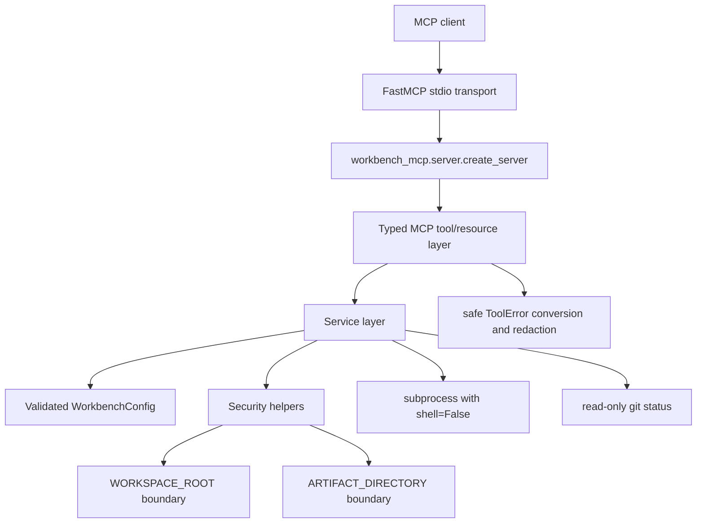

# workbench-mcp

`workbench-mcp` is a Python `FastMCP` server for controlled local workspace inspection,
bounded file reads/searches, guarded text patching, allowlisted test execution, read-only
Git status, approved artifact collection, and workspace diagnostics.

It is intended for developer workbenches where an MCP client needs useful repository
context without receiving unrestricted filesystem or shell access.

## Problem Statement

AI-assisted development tools often need to inspect files, run tests, and collect reports.
Giving those tools raw shell access or broad host filesystem access is risky. This project
wraps common development actions in typed MCP tools backed by explicit workspace,
artifact, command, timeout, output, and redaction controls.

## Project Status

Status: `v0.1.0` release preparation on branch `codex/workbench-mcp-v1`.

Implemented and locally verified:

- stdio FastMCP server startup.
- In-memory and stdio MCP client/server smoke tests.
- Docker image build, direct container smoke test, Compose config, and Compose smoke
  workflow.
- Reproducible public demo that creates a temporary Git workspace and writes a JSON report.
- GitHub Actions CI is green for the latest pushed Phase 7 commit
  `34fc81ae32e4404f01f3f460b43e6508e108421d` in run `29778875177`.
- Local final-audit fixes after that pushed commit require a new CI run after push.

Not implemented:

- HTTP or Streamable HTTP transport for this project.
- Complete arbitrary-code execution sandboxing.
- Package publishing, Docker image publishing, Git tags, or GitHub releases.

## Feature Overview

- Workspace metadata through `workspace_info`.
- Directory listing and UTF-8 text reads bounded to `WORKSPACE_ROOT`.
- Text search with glob, case-sensitivity, result, and output limits.
- One guarded expected-content text replacement through `apply_patch` when
  `READ_ONLY_MODE=false`.
- Allowlisted command execution using argument arrays and `shell=False`.
- Named predefined test commands with JSON reports under the artifact root.
- Read-only Git status using non-mutating Git commands.
- Approved artifact collection from category-specific artifact directories.
- Diagnostic findings for workspace, artifact, executable, Git, and transport state.
- Secret-pattern and host-root redaction before MCP-facing responses.

## Architecture



More detail: [docs/architecture.md](docs/architecture.md).

## Registered MCP Tools

These are the exact tool names registered by `src/workbench_mcp/tools/common.py` and
verified by `tests/unit/test_mcp_server.py`.

| Tool | Inputs | Behavior |
| --- | --- | --- |
| `workspace_info` | none | Returns sanitized workspace metadata, read-only status, limits, capabilities, and Git summary. |
| `list_files` | `relative_directory="."`, `max_depth=2`, `pattern=null`, `max_results=1000` | Lists workspace-contained files/directories/symlinks with depth and result limits. |
| `read_file` | `relative_path`, optional `start_line`, optional `line_count` | Reads a workspace-contained UTF-8 text file within size limits. |
| `search_text` | `query`, `relative_directory="."`, `glob=null`, `case_sensitive=false`, `result_limit=100`, `max_output_bytes=null` | Searches workspace text files with output and result bounds. |
| `apply_patch` | `relative_path`, `expected_content`, `replacement_content` | Replaces exactly one expected text block when writes are enabled. |
| `run_command` | `command`, `cwd="."` | Runs an allowlisted executable with argument-array execution. |
| `run_tests` | `test_name` | Runs a configured named test command and writes a test report. |
| `git_status` | none | Returns branch, staged/modified/untracked files, and diff statistics without mutating Git state. |
| `collect_artifact` | `category`, `relative_path` | Reads approved text artifacts from `test_report`, `coverage_report`, `structured_log`, or `diagnostic_report`. |
| `diagnose_workspace` | none | Returns structured findings with severity, evidence, probable cause, and remediation. |

No destructive Git tools, delete-file tools, shell tools, or unrestricted command tools are
registered.

## Server-Information Resource

Exact resource registration:

| Field | Value |
| --- | --- |
| Name | `server_info` |
| URI | `workbench://server-info` |
| MIME type | `application/json` |

Payload keys returned by `server_information_payload`:

```json
{
  "package_version": "0.1.0",
  "server_capabilities": {
    "workspace_inspection": true,
    "filesystem_read": true,
    "text_search": true,
    "controlled_text_patch": false,
    "allowlisted_commands": [],
    "predefined_tests": [],
    "git_status": true,
    "artifact_collection": true,
    "diagnostics": true
  },
  "registered_tool_names": [
    "workspace_info",
    "list_files",
    "read_file",
    "search_text",
    "apply_patch",
    "run_command",
    "run_tests",
    "git_status",
    "collect_artifact",
    "diagnose_workspace"
  ],
  "active_safety_limits": {
    "max_file_size_bytes": 1048576,
    "max_command_seconds": 30,
    "max_output_bytes": 1048576
  },
  "read_only_status": true,
  "sanitized_workspace_metadata": {
    "name": "workbench-mcp",
    "exists": true,
    "is_directory": true
  },
  "supported_transports": ["stdio"]
}
```

Values reflect the active configuration. The tool list and supported transports are fixed
for this release.

## Installation With uv

Install `uv`, then install the locked project environment:

```bash
uv sync --frozen --all-groups
uv run python --version
uv run workbench-mcp --version
```

On this Windows verification shell, bare `uv` is not on `PATH`; the equivalent verified
command prefix is:

```powershell
& $env:APPDATA\Python\Python313\Scripts\uv.exe run python --version
```

## Configuration Reference

Configuration loads from defaults, optional TOML via `WORKBENCH_MCP_CONFIG`, and
environment variables. Environment variables override TOML values.

| Environment variable | TOML key | Default | Notes |
| --- | --- | --- | --- |
| `WORKBENCH_MCP_CONFIG` | N/A | unset | Optional TOML file path. The file may contain a `[workbench_mcp]` table or top-level keys. |
| `WORKSPACE_ROOT` | `workspace_root` | current working directory | Must exist and be a directory. All workspace paths must resolve inside it. |
| `READ_ONLY_MODE` | `read_only_mode` | `true` | Blocks `apply_patch` when true. |
| `MAX_FILE_SIZE_BYTES` | `max_file_size_bytes` | `1048576` | Range: 1 to 100000000. Applies to text file reads/search inputs. |
| `MAX_COMMAND_SECONDS` | `max_command_seconds` | `30` | Range: 1 to 600. Applies to subprocess execution. |
| `MAX_OUTPUT_BYTES` | `max_output_bytes` | `1048576` | Range: 1 to 100000000. Applies to command and artifact output. |
| `ALLOWED_COMMANDS` | `allowed_commands` | empty | Comma-separated executables such as `python,pytest`, or JSON objects with `name`, `executable`, and optional `default_args`. Executables must be bare names. |
| `TEST_COMMANDS` | `test_commands` | empty | JSON list of objects with `name` and `command`, for example `[{"name":"unit","command":["pytest","tests/unit"]}]`. |
| `ARTIFACT_DIRECTORY` | `artifact_directory` | `artifacts` under workspace root | Must exist and be a directory. Artifact collection is category-bounded inside it. |
| `SECRET_PATTERNS` | `secret_patterns` | one token/password/API-key regex | JSON list of regex strings or comma-separated regex strings. |
| `LOG_LEVEL` | `log_level` | `INFO` | One of `DEBUG`, `INFO`, `WARNING`, `ERROR`, `CRITICAL`. |

Example TOML:

```toml
[workbench_mcp]
workspace_root = "."
read_only_mode = true
max_file_size_bytes = 1048576
max_command_seconds = 30
max_output_bytes = 1048576
allowed_commands = [{ name = "python", executable = "python" }]
test_commands = [{ name = "smoke", command = ["python", "-c", "print('ok')"] }]
artifact_directory = "artifacts"
secret_patterns = ["(?i)(api[_-]?key|token|secret|password)\\s*[:=]\\s*[^\\s]+"]
log_level = "INFO"
```

## Verified Stdio Quick Start

For an MCP client, configure stdio with:

```json
{
  "command": "uv",
  "args": ["run", "workbench-mcp", "--transport", "stdio"],
  "env": {
    "WORKSPACE_ROOT": "/path/to/workspace",
    "ARTIFACT_DIRECTORY": "/path/to/workspace/artifacts",
    "READ_ONLY_MODE": "true"
  }
}
```

Local stdio verification command:

```bash
uv run pytest tests/e2e/test_mcp_stdio.py
```

Do not configure HTTP ports for this project; HTTP is not implemented or tested here.

## Verified Docker Quick Start

Build and smoke-test the local image:

```bash
docker build -t workbench-mcp:local .
uv run python scripts/run-container-smoke.py --image workbench-mcp:local
```

Compose smoke workflow:

```bash
mkdir -p .workbench-demo/workspace .workbench-demo/artifacts
printf 'hello compose\n' > .workbench-demo/workspace/smoke.txt
docker compose config
docker compose run --rm --build workbench-mcp-smoke
```

PowerShell equivalent for the mount preparation:

```powershell
New-Item -ItemType Directory -Force .workbench-demo\workspace, .workbench-demo\artifacts | Out-Null
Set-Content -LiteralPath .workbench-demo\workspace\smoke.txt -Value "hello compose"
```

The container defaults to stdio, non-root UID/GID `10001:10001`, no published ports, no
host networking, no Docker socket mount, dropped Linux capabilities in Compose, and
`no-new-privileges:true` in smoke workflows.

## Demo

Run the public reproducible demo:

```bash
uv run python scripts/run-demo.py
```

The demo creates a temporary Git workspace, writes deterministic files, configures the real
server, invokes the MCP tools through a FastMCP client, runs an approved test, applies one
controlled patch, demonstrates a blocked traversal attempt, writes
`artifacts/demo/workbench-demo-report.json`, prints a short summary, and cleans up the
temporary workspace.

## Testing Commands

```bash
uv run ruff format --check .
uv run ruff check .
uv run mypy src
uv run pytest -rs
uv run pytest --cov=workbench_mcp --cov-report=term-missing
uv build
uv run pytest tests/e2e/test_mcp_stdio.py
uv run python scripts/run-demo.py
```

Docker checks:

```bash
docker build -t workbench-mcp:local .
uv run python scripts/run-container-smoke.py --image workbench-mcp:local
docker compose config
docker compose run --rm --build workbench-mcp-smoke
```

## Security Model

- Deny by default for commands and writes.
- Workspace paths are resolved with `pathlib` and must remain inside `WORKSPACE_ROOT`.
- Artifact paths are resolved inside category directories under `ARTIFACT_DIRECTORY`.
- Symlink escapes, parent traversal, absolute-path escapes, oversized files, binary text
  reads, shell operators, executable paths, command timeouts, bounded output capture, and
  truncation are covered by source checks and tests.
- Expected service errors are converted to sanitized MCP `ToolError` messages.
- Git behavior is read-only, bounded by the configured command timeout/output limit, and
  disables external diff execution for diff-stat inspection.
- Docker smoke workflows use a non-root runtime user and avoid privileged mounts.

This is not a complete arbitrary-code execution sandbox. Allowlisting a powerful executable
such as `python`, `pytest`, or `git` still grants that executable whatever behavior it can
perform inside the configured workspace and OS permissions.

More detail: [docs/threat-model.md](docs/threat-model.md) and [SECURITY.md](SECURITY.md).

## Known Limitations

- Only stdio transport is implemented and verified.
- HTTP and Streamable HTTP are not configured, exposed, or tested by this project.
- The server relies on host OS permissions; it is not a VM, kernel sandbox, or container
  escape prevention system.
- Windows symlink security tests skip when the OS denies symlink creation with
  `WinError 1314`; Linux CI runs those tests explicitly.
- Command safety depends on narrow allowlists. Do not allowlist broad interpreters for
  untrusted workspaces unless the surrounding environment is disposable.
- Artifact collection supports approved text suffixes only.
- Docker and Compose smoke workflows are finite verification commands, not a long-running
  hosted service.

## Troubleshooting

- `uv` not found: install uv or use the full `uv.exe` path on Windows as shown above.
- `workspace_root does not exist`: set `WORKSPACE_ROOT` to an existing directory.
- `artifact_directory does not exist`: create the directory or set `ARTIFACT_DIRECTORY`.
- `writes are blocked because READ_ONLY_MODE is enabled`: set `READ_ONLY_MODE=false` only
  for workspaces where controlled patching is acceptable.
- `executable is not allowlisted`: add a bare executable name to `ALLOWED_COMMANDS`.
- Docker bind-mount permission failures on Linux: run smoke workflows with a host-compatible
  UID/GID, as documented in [docs/runbook.md](docs/runbook.md).
- HTTP port questions: there is no project HTTP listener in this release.

## Evidence And Docs

- [PROJECT_EVIDENCE.md](PROJECT_EVIDENCE.md)
- [docs/architecture.md](docs/architecture.md)
- [docs/threat-model.md](docs/threat-model.md)
- [docs/runbook.md](docs/runbook.md)
- [docs/debugging.md](docs/debugging.md)
- [docs/failure-catalog.md](docs/failure-catalog.md)
- [docs/release-checklist-v0.1.0.md](docs/release-checklist-v0.1.0.md)
- [SECURITY.md](SECURITY.md)
- [CONTRIBUTING.md](CONTRIBUTING.md)
