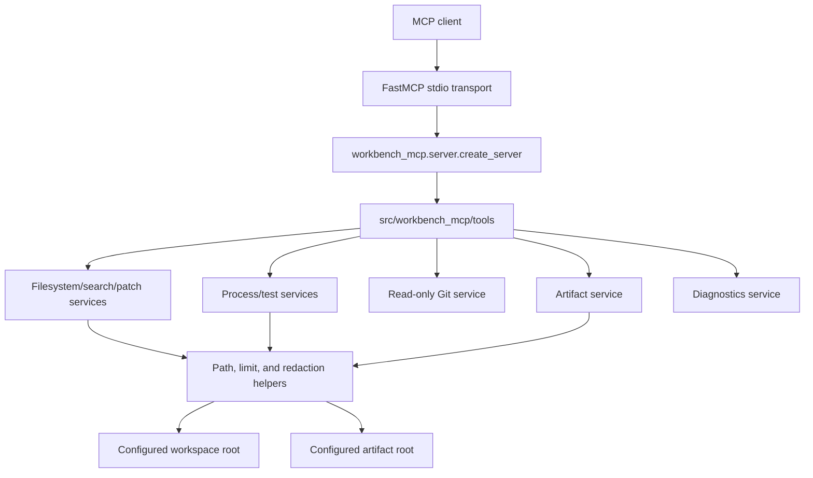

# Architecture

`workbench-mcp` is a secure FastMCP server that exposes a narrow MCP surface over a
configured local workspace. The FastMCP layer owns request schemas, tool/resource
registration, safe error conversion, and response serialization. It delegates filesystem,
process, Git, artifact, and diagnostic behavior to the service layer implemented in earlier
phases.

## Phase 4 Server Surface

- FastMCP version verified locally: `3.4.4`.
- Implemented transport: stdio.
- Deferred transport: Streamable HTTP. FastMCP supports it, but this project has not added a
  validated HTTP configuration or port-binding policy yet.
- Registered resource: `workbench://server-info`.
- Registered tools: `workspace_info`, `list_files`, `read_file`, `search_text`,
  `apply_patch`, `run_command`, `run_tests`, `git_status`, `collect_artifact`,
  `diagnose_workspace`.

## Safety Model

- Tool adapters reuse existing service modules and do not duplicate core security logic.
- Expected service exceptions are converted to `ToolError` with secret and root-path
  sanitization.
- Server metadata avoids raw environment variables, secrets, credentials, and absolute host
  workspace paths.
- Write behavior continues to be controlled by `READ_ONLY_MODE`.
- Command behavior continues to be controlled by allowlisted executable validation, argument
  arrays, workspace-contained working directories, timeouts, output limits, and redaction.
