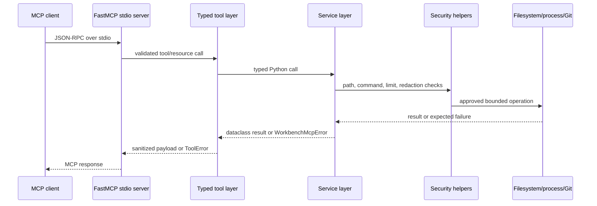

# Architecture

`workbench-mcp` exposes a narrow FastMCP stdio server around a configured local workspace.
The design goal is to make useful development operations available through typed tools
without exposing unrestricted filesystem, shell, artifact, or Git behavior.

## Request Flow

Only `stdio` is implemented by `src/workbench_mcp/server.py`. FastMCP itself supports other
transports, but this project has not added HTTP configuration, host/port policy, or HTTP
smoke tests.

## Layered Structure

| Layer | Source | Responsibility |
| --- | --- | --- |
| Server bootstrap | `src/workbench_mcp/server.py` | Load config, configure logging, construct FastMCP, register tools/resources, run stdio. |
| Tool layer | `src/workbench_mcp/tools/*.py` | Define MCP schemas, delegate to services, sanitize responses, convert expected errors. |
| Configuration | `src/workbench_mcp/config.py` | Load TOML/env/defaults, validate limits, commands, paths, secret patterns, and log level. |
| Security helpers | `src/workbench_mcp/security/*.py` | Enforce path containment, command token policy, size/output limits, and redaction. |
| Services | `src/workbench_mcp/services/*.py` | Implement filesystem, search, patch, process, tests, Git, artifacts, and diagnostics. |
| Tests | `tests/unit`, `tests/security`, `tests/e2e` | Cover unit behavior, security boundaries, and real MCP client/server interactions. |
| Containers | `Dockerfile`, `compose.yaml`, `scripts/*container*` | Package and verify the stdio runtime image. |

## Typed Tool Layer

The tool layer registers exactly ten tools:

- `workspace_info`
- `list_files`
- `read_file`
- `search_text`
- `apply_patch`
- `run_command`
- `run_tests`
- `git_status`
- `collect_artifact`
- `diagnose_workspace`

Tool functions use FastMCP and Pydantic field annotations for input validation. They avoid
reimplementing security-sensitive behavior and instead delegate to service classes. Expected
`WorkbenchMcpError` failures become sanitized FastMCP `ToolError` responses through
`src/workbench_mcp/tools/common.py`.

The `server_info` resource is registered at `workbench://server-info` with MIME type
`application/json`.

## Service Layer

- `FileSystemService` lists directories and reads UTF-8 text under the workspace boundary.
- `SearchService` recursively searches UTF-8 text files and skips oversized or binary files.
- `PatchingService` applies one expected-content guarded replacement with atomic file swap.
- `ProcessRunner` runs allowlisted or predefined commands using argument arrays.
- `TestRunner` runs named test commands and writes JSON reports under the artifact root.
- `GitService` performs read-only status and diff-stat inspection.
- `ArtifactService` reads approved text artifacts by category.
- `DiagnosticsService` emits structured findings for common local setup failures.

## Security Layer

Path checks in `security/paths.py` reject parent traversal, absolute-path escape, symlink
escape, unresolvable paths, and paths outside approved roots. Command checks in
`security/commands.py` reject shell operators, executable paths, whitespace executables,
control characters, and non-allowlisted executables. Limit helpers enforce file size,
UTF-8 text decoding, binary detection, and output truncation. Subprocess output is drained
through bounded stdout/stderr readers so the configured output limit is applied before
MCP-facing truncation.

Secret and host-root redaction is applied before MCP-facing responses or error messages
leave the tool layer.

## Workspace Boundary

`WORKSPACE_ROOT` is the only approved root for workspace file, search, patch, command CWD,
and Git status operations. Relative client paths are resolved under that root. Absolute
paths are accepted only if their resolved target is still inside the workspace. Parent
traversal is rejected before resolution.

## Artifact Boundary

`ARTIFACT_DIRECTORY` is separate from the workspace boundary. `collect_artifact` maps a
category to an approved subdirectory and suffix set:

| Category | Directory | Suffixes |
| --- | --- | --- |
| `test_report` | `test-reports` | `.json`, `.xml`, `.txt`, `.log` |
| `coverage_report` | `coverage` | `.json`, `.xml`, `.html`, `.txt` |
| `structured_log` | `logs` | `.json`, `.jsonl`, `.log` |
| `diagnostic_report` | `diagnostics` | `.json` |

Traversal, absolute escape, symlink escape, binary artifacts, and unapproved suffixes are
blocked.

## Subprocess Execution

`ProcessRunner` uses `subprocess.Popen(..., shell=False)` with a list of command tokens.
Client-supplied `run_command` calls must use an executable configured in
`ALLOWED_COMMANDS`. `run_tests` uses commands from `TEST_COMMANDS`. Both paths validate the
working directory inside `WORKSPACE_ROOT`, apply a timeout, terminate the process tree where
supported, capture bounded stdout/stderr prefixes, redact secrets, and truncate output.

This limits command invocation shape, but it does not make an allowlisted interpreter safe
for untrusted code by itself.

## Configuration Loading

`load_config` merges defaults, an optional TOML file from `WORKBENCH_MCP_CONFIG`, and
environment variables. Environment variables win. Invalid paths, duplicate command names,
invalid regex patterns, unsafe command tokens, malformed JSON, and out-of-range limits fail
startup with `ConfigError`.

## Error Conversion

Service code raises project exception types from `src/workbench_mcp/errors.py`. Tool
adapters call `call_safely`, which converts expected service failures to FastMCP
`ToolError` after redacting configured secret patterns and replacing configured host roots
with placeholders.

Unexpected programming errors are still masked by FastMCP server configuration
`mask_error_details=True`.

## Git Read-Only Behavior

`GitService` resolves `git` with `shutil.which`, checks repository status with
`rev-parse --is-inside-work-tree`, and then runs only:

- `branch --show-current`
- `status --porcelain=v1`
- `diff --no-ext-diff --shortstat`
- `diff --cached --no-ext-diff --shortstat`

It does not register push, pull, checkout, reset, clean, add, commit, branch deletion, or tag
operations. Git commands run with the configured timeout/output limit, `--no-pager`,
`GIT_OPTIONAL_LOCKS=0`, terminal prompts disabled, global/system config disabled, and
external diff disabled for diff statistics.

## Docker Runtime Model

The Docker image uses a digest-pinned `python:3.13.3-slim-bookworm` base, installs locked
runtime dependencies with uv in a build stage, copies the prepared virtual environment into
a runtime stage, and runs as non-root UID/GID `10001:10001`.

The image entry point is `workbench-mcp --transport stdio`. Compose smoke tests run a finite
verification command, not a persistent web service. Compose drops all Linux capabilities,
sets `no-new-privileges:true`, disables networking, mounts `/tmp` as tmpfs, mounts the
workspace read-only, and mounts artifacts read-write.

## Test Architecture

- Unit tests cover configuration, filesystem/search/patch services, process execution,
  test runner, Git, diagnostics, MCP registration, and smoke helpers.
- Security tests cover traversal, absolute escape, symlink escape where supported, artifact
  escape, read-only patch blocking, and command boundary behavior.
- E2E tests cover real FastMCP client/server interactions through in-memory and stdio
  transports, plus the public demo.
- CI runs the complete suite with coverage and explicitly runs Linux symlink tests that may
  skip on Windows when symlink creation is denied.
