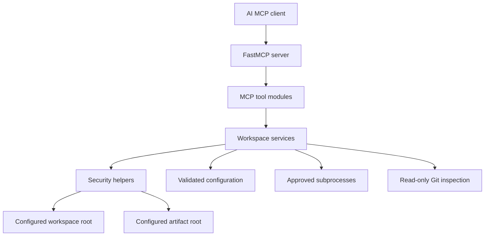

# Implementation Plan

## Architecture

`workbench-mcp` will be a Python package exposing a FastMCP server with a narrow service layer underneath it. MCP tools will validate request schemas, delegate to typed services, and return structured results. Services will depend on a shared validated configuration object and security helpers for path containment, command allowlisting, limits, and redaction.



## Repository Structure

Planned structure:

```text
src/workbench_mcp/
    __init__.py
    py.typed
    server.py
    config.py
    errors.py
    logging_config.py
    security/
    services/
    tools/
tests/
    unit/
    integration/
    security/
    e2e/
docs/
scripts/
artifacts/
```

Phase 1 established the package metadata, repository rules, validated configuration layer, and configuration tests. Phases 2 and 3 added the secure service layer. Phase 4 added FastMCP tool/resource registration and stdio startup. Later phases will add broader validation, Docker, CI, documentation hardening, and demo automation.

## Security Boundaries

- Workspace access is limited to `WORKSPACE_ROOT`.
- Artifact access is limited to `ARTIFACT_DIRECTORY`.
- All paths are resolved with `pathlib` before use.
- Relative paths are never trusted until resolved and checked against an approved root.
- Command execution is denied by default and later restricted to allowlisted executables and predefined test commands.
- Subprocess execution will always use argument arrays and never `shell=True`.
- Read and output sizes are bounded by configuration.
- Secrets are redacted using configured patterns before data reaches logs or MCP responses.
- Invalid critical configuration fails at startup.

## Implementation Phases

1. Repository foundation and configuration.
2. Path security and filesystem services.
3. Command, test, Git, artifact, and diagnostic services.
4. FastMCP server and tool registration.
5. Tests and security validation.
6. Docker and CI.
7. Documentation and reproducible demo.
8. Final clean verification.

## Phase Progress

- Phase 1: foundation and configuration implemented on branch `codex/workbench-mcp-v1`.
- Phase 2: path-security helpers, filesystem listing/reading, text search, and controlled
  patching services implemented with unit and security coverage.
- Phase 3: allowlisted process execution, predefined test execution, read-only Git status,
  approved artifact collection, and workspace diagnostics implemented with unit/security
  coverage.
- Phase 4: FastMCP `3.4.4` APIs were verified from the installed package. The server now
  registers the ten required MCP tools plus `workbench://server-info`, supports stdio
  transport, and has in-memory and stdio MCP client tests. Streamable HTTP is supported by
  FastMCP but remains unimplemented in this project because no validated HTTP configuration
  or port-binding policy exists yet.
- Later phases must not assume Docker, CI, demo automation, package builds, or coverage
  reporting are complete until those phases verify them.

## Testing Strategy

- Unit tests will cover configuration parsing, path security, filesystem behavior, command validation, redaction, patching, and artifact controls.
- Integration tests will cover service interactions against temporary repositories and workspaces.
- Security tests will cover traversal, symlink escape, oversized files, binary rejection, blocked executables, shell operators, truncation, timeout, and secret redaction.
- End-to-end tests will start the MCP server and exercise at least one real client/server interaction.
- Phase 4 added a real stdio FastMCP client/server E2E test using `StdioTransport`.
- Tests must use temporary directories and must not modify unrelated developer files.

## Docker Strategy

- Use a pinned minimal Python base image where possible.
- Install dependencies deterministically from `uv.lock`.
- Run as a non-root user.
- Avoid privileged mode and Docker socket mounts.
- Document workspace and artifact volume mounts.
- Keep runtime compatible with a read-only root filesystem where practical.
- Add a health check only if Streamable HTTP transport is implemented and verified.

## Technical Risks

- FastMCP APIs may change; tool registration and transport support must be verified from the installed stable package or official documentation before implementation.
- Windows path behavior differs from POSIX path behavior, especially around symlinks, permissions, drive letters, and executable resolution.
- Malicious repositories may contain symlink traps, large files, unusual encodings, or files designed to leak secrets.
- Command allowlists can be weakened accidentally if executable paths or shell operators are accepted.
- Docker permission behavior differs between Windows, macOS, and Linux bind mounts.

## Final Verification Commands

These commands are expected to be run before completion, adjusting only where later implementation proves a command unsupported:

```powershell
python -m uv sync --all-groups
python -m uv run ruff format --check .
python -m uv run ruff check .
python -m uv run mypy src tests
python -m uv run pytest --cov=workbench_mcp --cov-report=term-missing
python -m uv run python -m build
docker build -t workbench-mcp:local .
docker run --rm workbench-mcp:local --help
python -m uv run python scripts/demo.py
git status --short
```
