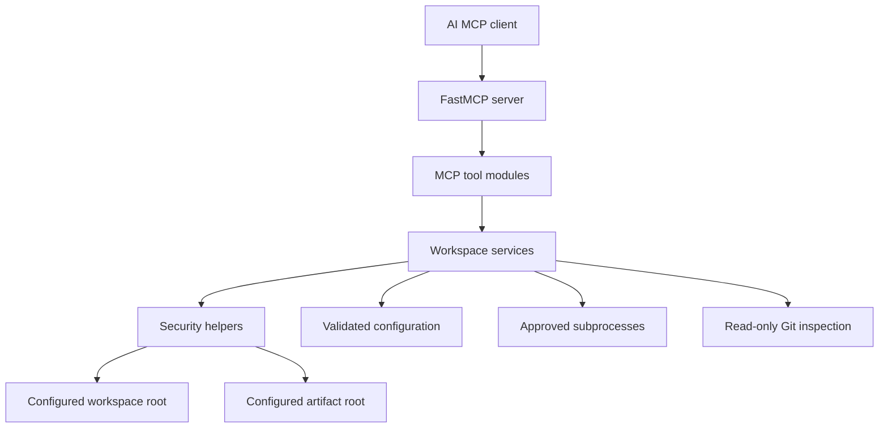

# Implementation Plan

## Architecture

`workbench-mcp` will be a Python package exposing a FastMCP server with a narrow service layer underneath it. MCP tools will validate request schemas, delegate to typed services, and return structured results. Services will depend on a shared validated configuration object and security helpers for path containment, command allowlisting, limits, and redaction.



## Repository Structure

Planned structure:

```text
src/workbench_mcp/
    __init__.py
    py.typed
    server.py
    config.py
    errors.py
    logging_config.py
    security/
    services/
    tools/
tests/
    unit/
    integration/
    security/
    e2e/
docs/
scripts/
artifacts/
```

Phase 1 established the package metadata, repository rules, validated configuration layer, and configuration tests. Phases 2 and 3 added the secure service layer. Phase 4 added FastMCP tool/resource registration and stdio startup. Phase 5 completed broad security and integration validation. Phase 6 added Docker packaging and CI configuration. Phase 7 adds public documentation, a reproducible demo, and release-preparation evidence. Phase 8 is reserved for the independent final audit.

## Security Boundaries

- Workspace access is limited to `WORKSPACE_ROOT`.
- Artifact access is limited to `ARTIFACT_DIRECTORY`.
- All paths are resolved with `pathlib` before use.
- Relative paths are never trusted until resolved and checked against an approved root.
- Command execution is denied by default and later restricted to allowlisted executables and predefined test commands.
- Subprocess execution will always use argument arrays and never `shell=True`.
- Read and output sizes are bounded by configuration.
- Secrets are redacted using configured patterns before data reaches logs or MCP responses.
- Invalid critical configuration fails at startup.

## Implementation Phases

1. Repository foundation and configuration.
2. Path security and filesystem services.
3. Command, test, Git, artifact, and diagnostic services.
4. FastMCP server and tool registration.
5. Tests and security validation.
6. Docker and CI.
7. Documentation and reproducible demo.
8. Final clean verification.

## Phase Progress

- Phase 1: foundation and configuration implemented on branch `codex/workbench-mcp-v1`.
- Phase 2: path-security helpers, filesystem listing/reading, text search, and controlled
  patching services implemented with unit and security coverage.
- Phase 3: allowlisted process execution, predefined test execution, read-only Git status,
  approved artifact collection, and workspace diagnostics implemented with unit/security
  coverage.
- Phase 4: FastMCP `3.4.4` APIs were verified from the installed package. The server now
  registers the ten required MCP tools plus `workbench://server-info`, supports stdio
  transport, and has in-memory and stdio MCP client tests. HTTP and Streamable HTTP remain
  unimplemented in this project because no validated HTTP configuration or port-binding
  policy exists yet.
- Phase 5: full test, security-search, coverage, package-build, and MCP stdio smoke
  verification completed. The full suite reported 83 passed and 4 Windows symlink skips.
  Coverage was measured at combined 83%, with 1074/1254 statements and 200/274 branches
  covered. `uv build` produced the source distribution and wheel.
- Phase 6: Docker packaging, Docker Compose smoke workflow, container smoke testing, and
  GitHub Actions CI configuration implemented. Local Docker verification is recorded in
  `PROJECT_EVIDENCE.md`.
- Phase 7: public README, architecture docs, threat model, runbook, debugging notes,
  security policy, contributing guide, changelog, release checklist, project evidence, and
  reproducible demo are prepared. Remote GitHub Actions is green for commit
  `4efddd89c8aed22310f3dc14a74ed1e215ec21e1`.
- Phase 8 remains the independent final audit and has not started.

## Testing Strategy

- Unit tests will cover configuration parsing, path security, filesystem behavior, command validation, redaction, patching, and artifact controls.
- Integration tests will cover service interactions against temporary repositories and workspaces.
- Security tests will cover traversal, symlink escape, oversized files, binary rejection, blocked executables, shell operators, truncation, timeout, and secret redaction.
- End-to-end tests will start the MCP server and exercise at least one real client/server interaction.
- Phase 4 added a real stdio FastMCP client/server E2E test using `StdioTransport`.
- Phase 5 added explicit audit coverage for read-only Git subcommands and artifact-directory
  permission-style diagnostic findings.
- Tests must use temporary directories and must not modify unrelated developer files.

## Docker Strategy

- Use `python:3.13.3-slim-bookworm` pinned by digest for the current Python-compatible
  runtime image.
- Install runtime dependencies deterministically with `uv==0.11.29` and `uv sync --frozen
  --no-dev --no-editable`.
- Build in a separate stage and copy the prepared virtual environment into the runtime
  stage.
- Run as non-root UID/GID `10001:10001`.
- Keep stdio as the container entry point and do not publish HTTP ports because HTTP is not
  implemented by this project.
- Avoid privileged mode, host networking, and Docker socket mounts.
- Use explicit `/workspace` and `/artifacts` mounts; Compose mounts the workspace read-only
  by default and the artifact directory read-write.
- Support read-only root filesystem execution with tmpfs-backed `/tmp` for smoke workflows.
- Do not add a health check while there is no persistent HTTP service.

## Technical Risks

- FastMCP APIs may change; tool registration and transport support must be verified from the installed stable package or official documentation before implementation.
- Windows path behavior differs from POSIX path behavior, especially around symlinks, permissions, drive letters, and executable resolution.
- Malicious repositories may contain symlink traps, large files, unusual encodings, or files designed to leak secrets.
- Command allowlists can be weakened accidentally if executable paths or shell operators are accepted.
- Docker permission behavior differs between Windows, macOS, and Linux bind mounts.

## Final Verification Commands

These commands are expected to be run before completion, adjusting only where later implementation proves a command unsupported:

```powershell
& $env:APPDATA\Python\Python313\Scripts\uv.exe sync --frozen --all-groups
& $env:APPDATA\Python\Python313\Scripts\uv.exe run ruff format --check .
& $env:APPDATA\Python\Python313\Scripts\uv.exe run ruff check .
& $env:APPDATA\Python\Python313\Scripts\uv.exe run mypy src
& $env:APPDATA\Python\Python313\Scripts\uv.exe run pytest -rs
& $env:APPDATA\Python\Python313\Scripts\uv.exe run pytest --cov=workbench_mcp --cov-report=term-missing
& $env:APPDATA\Python\Python313\Scripts\uv.exe build
& $env:APPDATA\Python\Python313\Scripts\uv.exe run pytest tests\e2e\test_mcp_stdio.py
docker build -t workbench-mcp:local .
docker image inspect workbench-mcp:local
& $env:APPDATA\Python\Python313\Scripts\uv.exe run python scripts\run-container-smoke.py --image workbench-mcp:local
docker compose config
docker compose run --rm --build workbench-mcp-smoke
git status --short
```
